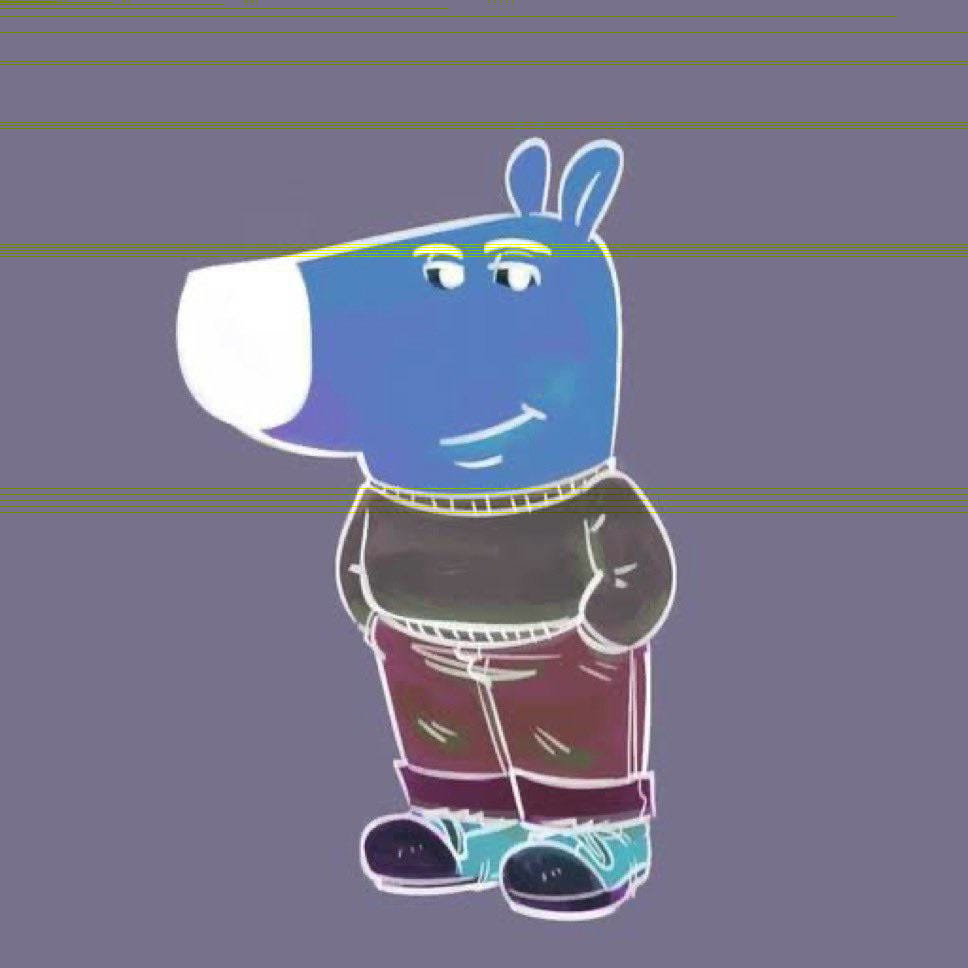

# Image Shading
A C# library that allows you to write your own fragment shader.
U can then use you shader o edit some image.

## Integration

### Add DLL:
1. Download the **DLL** from _Release_
2. In Visual Studio, click _Project/Add Reference_
3. Locate the **DLL** and add reference to it

### Link Library to Project
1. Add Library to your solution
2. In Visual Studio, hgclick _Project/Add Reference_
3. in _/Project_ locate the library
4. Click **Add Reference**

## Usage

### Custom Fragment Shader
Example shader for color inversion:
```csharp
using System.Drawing;
using ImageShading.Core;

public class InverShader : Fragment
{
    public override Color SetFragment(int x, int y)
    {
        var pixel = SampleScreenBuffer(x, y);
        return Color.FromArgb(
            255,
            255 - pixel.R,
            255 - pixel.G,
            255 - pixel.B
        );
    }
}
```

### Shading Image
How to use your custom shader on a image:
```csharp
public static void Main(string[] args)
{
    ImageShading.Core.Painter.ShadeImage(
        "in_image.jpg",
        "out_image.png",
        new InverShader() 
    );
}
```

### Result
Input: <br>


Output: <br>
